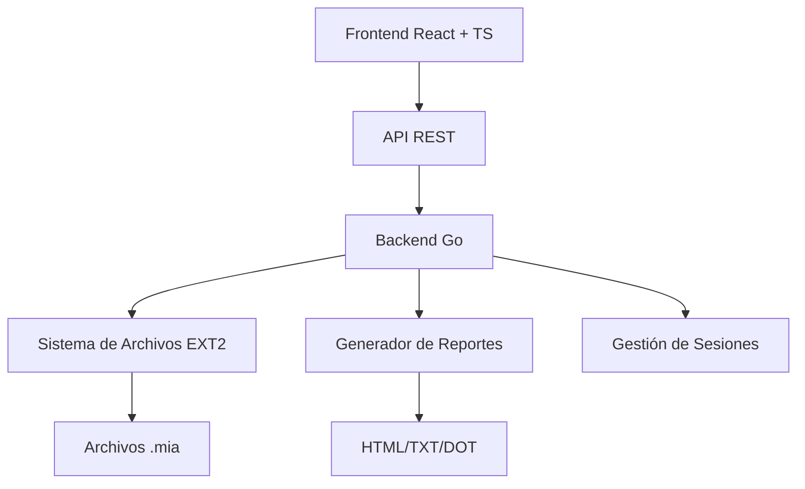

# Manual Técnico - Christian Chinchilla - 202308227
## ExtreamFS
## Tabla de Contenidos

1. [Introducción](#introducción)
2. [Arquitectura del Sistema](#arquitectura-del-sistema)
3. [Estructuras de Datos](#estructuras-de-datos)
4. [Comandos Implementados](#comandos-implementados)
5. [Interfaz de Usuario](#interfaz-de-usuario)
6. [Reportes del Sistema](#reportes-del-sistema)
7. [Consideraciones Técnicas](#consideraciones-técnicas)
8. [Conclusiones](#conclusiones)

---

##  Introducción

ExtreamFS es una aplicación web que simula un sistema de archivos EXT2 completo, permitiendo la gestión de discos virtuales, particiones, usuarios, grupos y archivos a través de una interfaz web moderna. El sistema implementa las estructuras de datos fundamentales del sistema de archivos EXT2 y proporciona comandos para su manipulación.

### Objetivos del Sistema

- **Simulación completa del sistema EXT2**: Implementación fiel de las estructuras MBR, EBR, superbloque, inodos y bloques
- **Gestión de usuarios y permisos**: Sistema completo de autenticación y autorización
- **Interfaz web intuitiva**: Frontend moderno desarrollado en React con TypeScript
- **Generación de reportes**: Visualización gráfica y textual del estado del sistema
- **Persistencia de datos**: Almacenamiento en archivos binarios .mia

---

## Arquitectura del Sistema

### Diagrama de Arquitectura General

```
┌─────────────────────────────────────────────────────────────┐
│                    FRONTEND (React + TS)                    │
├─────────────────────────────────────────────────────────────┤
│  ┌─────────────┐  ┌─────────────┐  ┌─────────────┐          │
│  │    UI       │  │   Commands  │  │   Reports   │          │
│  │ Components  │  │   Parser    │  │   Viewer    │          │
│  └─────────────┘  └─────────────┘  └─────────────┘          │
└─────────────────────────────────────────────────────────────┘
                              │ HTTP API
                              ▼
┌─────────────────────────────────────────────────────────────┐
│                         BACKEND (Go)                        │
├─────────────────────────────────────────────────────────────┤
│  ┌─────────────┐  ┌─────────────┐  ┌─────────────┐          │
│  │   Command   │  │   File      │  │   Report    │          │
│  │   Handlers  │  │   System    │  │  Generator  │          │
│  └─────────────┘  └─────────────┘  └─────────────┘          │
│                              │                              │
│  ┌─────────────┐  ┌─────────────┐  ┌─────────────┐          │
│  │   Structs   │  │   Session   │  │   Storage   │          │
│  │   Manager   │  │   Manager   │  │   Manager   │          │
│  └─────────────┘  └─────────────┘  └─────────────┘          │
└─────────────────────────────────────────────────────────────┘
                              │
                              ▼
┌─────────────────────────────────────────────────────────────┐
│                         ALMACENAMIENTO                      │
├─────────────────────────────────────────────────────────────┤
│  ┌─────────────┐  ┌─────────────┐  ┌─────────────┐          │
│  │  Archivos   │  │   Reportes  │  │   Sesiones  │          │
│  │    .mia     │  │ HTML/TXT/DOT│  │    JSON     │          │
│  └─────────────┘  └─────────────┘  └─────────────┘          │
└─────────────────────────────────────────────────────────────┘
```

### Tecnologías Implementadas


---

### Componentes del Sistema

#### Frontend (React + TypeScript)
- **Tecnologías**: React 18, TypeScript, Vite, CSS3
- **Responsabilidades**:
  - Interfaz de usuario intuitiva
  - Validación de comandos en tiempo real
  - Visualización de reportes
  - Gestión de estado de la aplicación

#### Backend (Go)
- **Tecnologías**: Go 1.21+, Gin Framework, Binary I/O
- **Responsabilidades**:
  - Procesamiento de comandos
  - Gestión del sistema de archivos
  - Generación de reportes
  - Autenticación y autorización

### Comunicación Entre Componentes

```go
// Estructura de comunicación API
type APIRequest struct {
    Command    string `json:"command"`
    Parameters string `json:"parameters"`
    SessionID  string `json:"session_id"`
}

type APIResponse struct {
    Success bool   `json:"success"`
    Message string `json:"message"`
    Data    interface{} `json:"data,omitempty"`
}
```

---

## Estructuras de Datos

### Master Boot Record (MBR)

El MBR es la primera estructura del disco y contiene información sobre las particiones.

```go
type MBR struct {
    Mbr_size           int64        // Tamaño total del disco
    Mbr_creation_date  int64        // Fecha de creación
    Mbr_disk_signature int64        // Firma única del disco
    Dsk_fit            byte         // Tipo de ajuste (F, B, W)
    Mbr_partitions     [4]Partition // Array de particiones
}
```

**Campos del MBR:**
- `Mbr_size`: Tamaño total del disco en bytes
- `Mbr_creation_date`: Timestamp de creación del disco
- `Mbr_disk_signature`: Identificador único del disco
- `Dsk_fit`: Algoritmo de ajuste para particiones (First, Best, Worst)
- `Mbr_partitions`: Array de 4 particiones máximo

### Extended Boot Record (EBR)

El EBR gestiona particiones lógicas dentro de una partición extendida.

```go
type EBR struct {
    Part_status byte   // Estado de la partición (A=activa)
    Part_fit    byte   // Tipo de ajuste
    Part_start  int64  // Byte donde inicia la partición
    Part_size   int64  // Tamaño en bytes
    Part_next   int64  // Byte donde inicia el siguiente EBR
    Part_name   [16]byte // Nombre de la partición
}
```

### Partición

```go
type Partition struct {
    Part_status byte     // Estado (A=activa, I=inactiva)
    Part_type   byte     // Tipo (P=primaria, E=extendida, L=lógica)
    Part_fit    byte     // Ajuste (F, B, W)
    Part_start  int64    // Posición de inicio
    Part_size   int64    // Tamaño en bytes
    Part_name   [16]byte // Nombre de la partición
}
```

### SuperBloque

El superbloque contiene metadatos del sistema de archivos EXT2.

```go
type SuperBloque struct {
    S_filesystem_type   int64  // Tipo de sistema de archivos
    S_inodes_count      int64  // Número total de inodos
    S_blocks_count      int64  // Número total de bloques
    S_free_blocks_count int64  // Bloques libres
    S_free_inodes_count int64  // Inodos libres
    S_mtime             int64  // Fecha de último montaje
    S_umtime            int64  // Fecha de último desmontaje
    S_mnt_count         int64  // Veces que se ha montado
    S_magic             int64  // Número mágico del sistema
    S_inode_s           int64  // Tamaño de inodo
    S_block_s           int64  // Tamaño de bloque
    S_first_ino         int64  // Primer inodo libre
    S_first_blo         int64  // Primer bloque libre
    S_bm_inode_start    int64  // Inicio bitmap inodos
    S_bm_block_start    int64  // Inicio bitmap bloques
    S_inode_start       int64  // Inicio tabla inodos
    S_block_start       int64  // Inicio bloques de datos
}
```

### Inodos

Los inodos contienen metadatos de archivos y directorios.

```go
type Inodos struct {
    I_uid   int64      // ID del usuario propietario
    I_gid   int64      // ID del grupo propietario
    I_s     int64      // Tamaño del archivo en bytes
    I_atime int64      // Última fecha de acceso
    I_ctime int64      // Fecha de creación
    I_mtime int64      // Fecha de modificación
    I_block [15]int64  // Array de bloques
    I_type  byte       // Tipo (0=directorio, 1=archivo)
    I_perm  [3]byte    // Permisos (UGO)
}
```

**Distribución de I_block:**
- `I_block[0-11]`: Bloques directos
- `I_block[12]`: Bloque de apuntadores simples
- `I_block[13]`: Bloque de apuntadores dobles
- `I_block[14]`: Bloque de apuntadores triples

### Bloques

#### Bloque de Carpeta
```go
type BloqueCarpeta struct {
    BContent [4]BContent 
}

type BContent struct {
    BName  [12]byte 
    BInodo int64    
}
```

#### Bloque de Archivo
```go
type BloqueArchivo struct {
    BContent [64]byte 
}
```

#### Bloque de Apuntadores
```go
type BloqueApuntador struct {
    BPointers [16]int64 /
}
```

---

##  Comandos Implementados

### Comandos de Gestión de Discos

#### MKDISK - Crear Disco Virtual

**Sintaxis:**
```bash
mkdisk -size=3000 -unit=M -path=/home/user/Disco1.mia
```

**Parámetros:**
- `size`: Tamaño del disco (obligatorio)
- `unit`: Unidad (B=bytes, K=kilobytes, M=megabytes)
- `path`: Ruta donde crear el archivo (obligatorio)

**Funcionamiento:**
1. Validación de parámetros
2. Creación del archivo binario
3. Inicialización del MBR
4. Llenado con bytes cero

#### RMDISK - Eliminar Disco Virtual

**Sintaxis:**
```bash
rmdisk -path=/home/user/Disco1.mia
```

### Comandos de Gestión de Particiones

#### FDISK - Gestionar Particiones

**Sintaxis:**
```bash
fdisk -size=1000 -unit=M -path=/home/user/Disco1.mia -type=P -name=Particion1
```

**Parámetros:**
- `size`: Tamaño de la partición
- `unit`: Unidad de medida
- `path`: Ruta del disco
- `type`: Tipo (P=primaria, E=extendida, L=lógica)
- `name`: Nombre de la partición
- `add`: Agregar espacio a partición existente
- `delete`: Eliminar partición

**Algoritmos de Ajuste:**
- **First Fit**: Primer espacio disponible
- **Best Fit**: Mejor ajuste (menor desperdicio)
- **Worst Fit**: Peor ajuste (mayor espacio restante)

### Comandos de Sistema de Archivos

#### MKFS - Formatear Partición

**Sintaxis:**
```bash
mkfs -id=A118 -type=full
```

**Parámetros:**
- `id`: ID de la partición montada
- `type`: Tipo de formateo (full, fast)

**Proceso de Formateo:**
1. Cálculo de estructuras necesarias
2. Creación del superbloque
3. Inicialización de bitmaps
4. Creación de tabla de inodos
5. Inicialización de bloques de datos

#### MOUNT - Montar Partición

**Sintaxis:**
```bash
mount -path=/home/user/Disco1.mia -name=Particion1
```

**Sistema de IDs:**
```
Formato: [Número][Letra][Número]
Ejemplo: 501A = 50 (correlativo) + 1A (primer disco)
```

### Comandos de Usuarios y Grupos

#### MKUSR - Crear Usuario

**Sintaxis:**
```bash
mkusr -user=usuario1 -pass=123 -grp=usuarios
```

#### MKGRP - Crear Grupo

**Sintaxis:**
```bash
mkgrp -name=usuarios
```

#### LOGIN - Iniciar Sesión

**Sintaxis:**
```bash
login -user=root -pass=123 -id=A118
```

### Comandos de Archivos y Directorios

#### MKDIR - Crear Directorio

**Sintaxis:**
```bash
mkdir -path=/home/folder1 -p
```

**Parámetros:**
- `path`: Ruta del directorio
- `p`: Crear directorios padre si no existen

#### MKFILE - Crear Archivo

**Sintaxis:**
```bash
mkfile -path=/home/archivo.txt -size=100 -cont="Contenido del archivo"
```

#### CAT - Mostrar Contenido

**Sintaxis:**
```bash
cat -file1=/home/archivo.txt
```

### Comandos de Reportes

#### REP - Generar Reportes

**Sintaxis General:**
```bash
rep -id=A118 -path=/home/reportes/reporte.html -name=tipo_reporte
```

**Tipos de Reportes:**

1. **MBR**: Información del Master Boot Record
```bash
rep -id=A118 -path=/reports/mbr.html -name=mbr
```

2. **DISK**: Visualización gráfica del disco
```bash
rep -id=A118 -path=/reports/disk.html -name=disk
```

3. **INODE**: Información de inodos específicos
```bash
rep -id=A118 -path=/reports/inode.html -name=inode
```

4. **JOURNALING**: Bitácora del sistema
```bash
rep -id=A118 -path=/reports/journal.html -name=journaling
```

5. **BLOCK**: Información de bloques específicos
```bash
rep -id=A118 -path=/reports/block.html -name=block
```

6. **BM_INODE**: Bitmap de inodos
```bash
rep -id=A118 -path=/reports/bm_inode.html -name=bm_inode
```

7. **BM_BLOCK**: Bitmap de bloques
```bash
rep -id=A118 -path=/reports/bm_block.html -name=bm_block
```

8. **TREE**: Árbol del sistema de archivos
```bash
rep -id=A118 -path=/reports/tree.html -name=tree
```

9. **SB**: Información del superbloque
```bash
rep -id=A118 -path=/reports/sb.html -name=sb
```

10. **FILE**: Contenido de archivo específico
```bash
rep -id=A118 -path=/reports/file.txt -name=file -path_file_ls=/home/archivo.txt
```

11. **LS**: Listado de directorio
```bash
rep -id=A118 -path=/reports/ls.html -name=ls -path_file_ls=/home
```

---

## Interfaz de Usuario

### Tecnologías Frontend

```json
{
  "name": "extreamfs-frontend",
  "dependencies": {
    "react": "^18.0.0",
    "typescript": "^5.0.0",
    "vite": "^5.0.0"
  }
}
```

### Componentes Principales

#### App.tsx - Componente Principal
```typescript
interface Command {
  id: string;
  command: string;
  timestamp: Date;
  status: 'success' | 'error' | 'pending';
  output: string;
}

function App() {
  const [commands, setCommands] = useState<Command[]>([]);
  const [currentCommand, setCurrentCommand] = useState('');
  
  // Lógica de la aplicación
}
```

#### Características de la Interfaz
- **Terminal Simulada**: Interfaz de línea de comandos
- **Historial de Comandos**: Registro de comandos ejecutados
- **Syntax Highlighting**: Resaltado de sintaxis
- **Autocompletado**: Sugerencias de comandos
- **Responsive Design**: Adaptable a diferentes dispositivos

---

##  Reportes del Sistema

### Generación de Reportes

El sistema genera reportes en múltiples formatos:

#### Reportes HTML
- Interfaz visual moderna
- Gráficos interactivos
- Tablas responsivas
- Animaciones CSS

#### Reportes de Texto
- Formato plano para archivos
- Información detallada
- Fácil procesamiento

### Ejemplo de Implementación

```go
func generateHTMLReport(content, outputPath, reportType string) {
    template := `
    <!DOCTYPE html>
    <html>
    <head>
        <title>Reporte %s - ExtreamFS</title>
        <style>/* CSS Styles */</style>
    </head>
    <body>%s</body>
    </html>
    `
    
    finalHTML := fmt.Sprintf(template, reportType, content)
    os.WriteFile(outputPath, []byte(finalHTML), 0644)
}
```

---

## Consideraciones Técnicas

### Gestión de Memoria

```go
// Lectura eficiente de estructuras binarias
func readStructure(file *os.File, offset int64, structure interface{}) error {
    file.Seek(offset, 0)
    return binary.Read(file, binary.LittleEndian, structure)
}
```

### Manejo de Errores

```go
type SystemError struct {
    Code    int    `json:"code"`
    Message string `json:"message"`
    Details string `json:"details,omitempty"`
}

func (e *SystemError) Error() string {
    return fmt.Sprintf("[%d] %s", e.Code, e.Message)
}
```

### Concurrencia y Seguridad

- **Mutex para archivos**: Prevención de escrituras concurrentes
- **Validación de sesiones**: Verificación de autenticación
- **Sanitización de entrada**: Prevención de inyección de código

### Optimizaciones

1. **Cache de Metadatos**: Almacenamiento en memoria de estructuras frecuentes
2. **Lazy Loading**: Carga bajo demanda de bloques de datos
3. **Batch Operations**: Agrupación de operaciones de I/O

---

##  Instalación y Configuración

### Requisitos del Sistema

#### Backend
- Go 1.21 o superior
- Espacio en disco para archivos .mia
- Permisos de escritura en directorios de trabajo

#### Frontend
- Node.js 18 o superior
- npm o yarn
- Navegador web moderno

### Compilación y Ejecución

#### Backend
```bash
cd backend
go mod tidy
go build -o extreamfs main.go
./extreamfs
```

#### Frontend
```bash
cd front
npm install
npm run dev
```

### Configuración de CORS

```go
func setupCORS() gin.HandlerFunc {
    return cors.New(cors.Config{
        AllowOrigins:     []string{"http://localhost:5173"},
        AllowMethods:     []string{"GET", "POST", "OPTIONS"},
        AllowHeaders:     []string{"Content-Type", "Authorization"},
        AllowCredentials: true,
    })
}
```

---

##  Casos de Uso

### Caso 1: Creación Completa de Disco

```bash
# 1. Crear disco
mkdisk -size=10 -unit=M -path=/tmp/disco1.mia

# 2. Crear partición primaria
fdisk -size=3 -unit=M -path=/tmp/disco1.mia -type=P -name=Particion1

# 3. Montar partición
mount -path=/tmp/disco1.mia -name=Particion1

# 4. Formatear como EXT2
mkfs -id=501A -type=full

# 5. Iniciar sesión como root
login -user=root -pass=123 -id=501A
```

### Caso 2: Gestión de Usuarios

```bash
# Crear grupos
mkgrp -name=usuarios
mkgrp -name=administradores

# Crear usuarios
mkusr -user=juan -pass=123 -grp=usuarios
mkusr -user=admin -pass=admin123 -grp=administradores

# Cambiar permisos
chgrp -user=juan -grp=administradores
```

### Caso 3: Operaciones con Archivos

```bash
# Crear estructura de directorios
mkdir -path=/home -p
mkdir -path=/home/juan -p
mkdir -path=/var/log -p

# Crear archivos
mkfile -path=/home/juan/documento.txt -cont="Contenido del documento"
mkfile -path=/var/log/sistema.log -size=1024

# Visualizar contenido
cat -file1=/home/juan/documento.txt
```

---

##  Testing y Validación

### Tests de Unidad

```go
func TestMBRCreation(t *testing.T) {
    mbr := createMBR(1024*1024, "F")
    
    assert.Equal(t, int64(1024*1024), mbr.Mbr_size)
    assert.Equal(t, byte('F'), mbr.Dsk_fit)
    assert.NotZero(t, mbr.Mbr_creation_date)
}
```

### Tests de Integración

```bash
# Script de pruebas automatizadas
#!/bin/bash

# Crear disco de prueba
curl -X POST localhost:8080/command \
  -d '{"command": "mkdisk -size=5 -unit=M -path=/tmp/test.mia"}'

# Verificar creación
[ -f "/tmp/test.mia" ] && echo "Disco creado" || echo "Error"
```

---

##  Conclusiones

### Logros del Proyecto

1. **Implementación Completa**: Sistema EXT2 funcional con todas las estructuras
2. **Interfaz Moderna**: Frontend React intuitivo y responsive
3. **Arquitectura Escalable**: Diseño modular y extensible
4. **Reportes Completos**: Visualización detallada del sistema
5. **Gestión de Usuarios**: Sistema de permisos robusto

### Características Destacadas

- **Fidelidad al EXT2**: Implementación apegada al estándar
- **Performance**: Operaciones optimizadas de I/O
- **Usabilidad**: Interfaz intuitiva tipo terminal
- **Extensibilidad**: Arquitectura preparada para nuevas funcionalidades